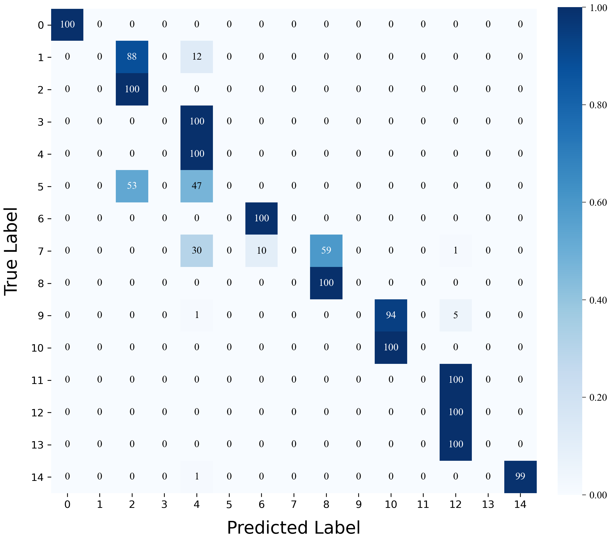

# ACCS

## Architecture

We propose an indoor positioning method based on the frequency fading characteristics of broadband signals, named the ACCS algorithm. This method introduces the innovative use of the autocorrelation spectrum of broadband signals to transform the indoor positioning problem into an image classification task. After that, to achieve lightweight model design, a Convolutional Autoencoder (CAE), which is an unsupervised learning model based on convolutional neural networks, is employed to reduce the dimension and compress the input images. Finally, a deep residual network combined with a CS-Attention module, which is composed of a channel feature extraction module and a spatial feature extraction module, is used to efficiently capture image features for more accurate position estimation. 

<p align="center">

</p>


## Results
####  Experimental results in complex indoor environments:


<p align="center">

</p>

<p align="center">

</p>

[//]: # (<p align="center">)

[//]: # ()

[//]: # (</p>)


## Usage:
### Data preparation:


- Download the datasets [Edge Drive](https://pan.baidu.com/s/1uz0Vj0FGzjnwa668eSynVg?pwd=b83z) and move them into './data/' folder.


### Pretrained Checkpoint:
- If you only want to perform inference to validate the effectiveness of the model,you can download the Pretrained Checkpoint model from [Edge Drive](https://pan.baidu.com/s/1RewWIP2C7ZfCZ84rVVa7lw?pwd=sfqc) and put it in the './checkpoints/' folder and then run the command in the Test section below .


### Recommended environment:
#### **Please run the following code to create the environment.**
```
conda create -name torch python=3.9
conda activate torch

pip install -r requirements.txt
```


### Training and Testing

To train and test the model, simply run the `main.py` script. Before starting the training process, you need to launch the Visdom server for visualization purposes.

1. Start the Visdom server:
```bash
python -m visdom.server
```
You can access the Visdom dashboard at `http://localhost:8097` in your web browser.

2. Uncomment the corresponding lines in the `if __name__ == "__main__"` block of `main.py` to enable training or testing.

3. Run training and testing:
```bash
python main.py
```

